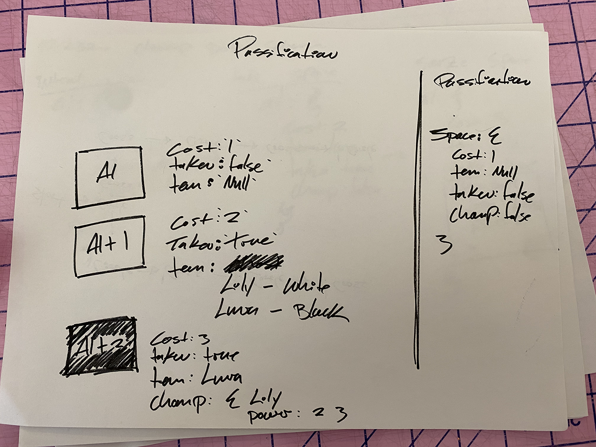

# [Chomp!](https://patrickdepuydt.github.io/Chomp/src/index.html)
MAARK010621-v2

[Click here to see the](https://patrickdepuydt.github.io/Chomp/src/index.html) project in the wild.

### Tech Stack

* HTML, CSS, & ECMA baby
* Fonts: [Work Sans (Bold)](https://fonts.google.com/specimen/Work+Sans) | [Nunito (Bold)](https://fonts.google.com/specimen/Nunito)
* Animation Helper: [Animate.Style](https://animate.style)
* Color Pallet Helper: [Coolors](https://coolors.co/)

---
# Development Process

## TL;DR:
 

## Long Form

### Original Idea

The original idea came from a board game called [Goblet!](https://www.youtube.com/watch?v=XE6YYMn_334) which is a modified tic-tac-toe with tree curious features.

**A**. You can overtake another piece (if your piece is large enough), but with two conditions: 
> 1. only if that piece is already on the board 
> 2. if the piece you want to overtake is smaller in size than yours.

**B**. You can move pieces after playing them instead of choosing a new piece.
> 1. But only one space at a time

**C**. If either opponent has 3 in a row, you can gobble one of the 3 aligned pieces thus thwarting your opponents plan.

### Step 1: Problem Solving Process

I struggle with problems I can't see, so to 

There is also the matter of programatic thinking and problem solving, which starts by championing seeking the shortest distance between two points.

Put another way, break the problem down into it's smallest, most simplest components and start there.

I've found this advice helpful in hindsight when reflecting but when I'm buried in log errors, it's a distant thought.

Here are some of the things I did to teach myself about what problem I was trying to solve.

I used my cats' names as internal logic variables.
Why: 

| Approach | Image | Technique |
|:-----------|:------------:|------------:|
|  Wireframes/Flow Charts |    | This process was somewhat illustrative of abstracted logic, but it didn't break down any of the problems I would later face nor did it prepare me well for them. |
|  Drawing out each play |  | Adding each play and having to draw out the grid was very time-consuming, but it gave me time to think between the moves what I would need to keep track of. |
|  Journal Rubber Duck |  | I often find I think while I'm talking, which ended up being similar to the misguided practice referred to as as "Rubber Ducking". This allowed me to get thoughts out that were in plain English, which sometimes resulted in action items, most of the time it just allowed me to focus better. |
|  Mocks |  | The layout design came together in one fell swoop. I find that wireframes are helpful in design thinking only in certain contexts, and are a hindrance in other, especially creative, situations.|

#### Original Approach: Wireframes

| One | Two |
|:-----------:|:------------:|
|  |  |

|Tree|Four|
|:-----------:|:------------:|
|  |  |