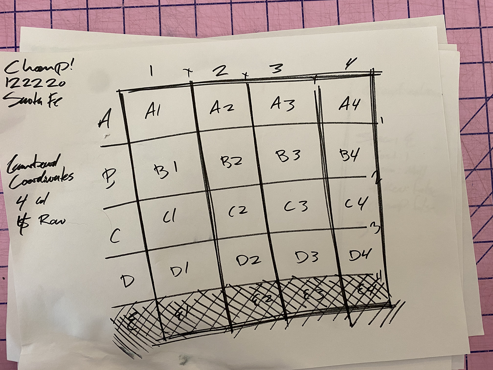

# [Chomp!]()
MAARK010621-v2

[Click here to see the](src/index.html) project in the wild.

---

# Development Process

## Original Idea

The original idea came from a board game called [Goblet!](https://www.youtube.com/watch?v=XE6YYMn_334) which is a modified tic-tac-toe with some intresting features.
1. You can overtake another piece (if your piece is large enough).
2. You can move pieces after playing them instead of choosing a new piece
3. If either opponent has 3 in a row, you can gobble one of the 3 aligned pieces thus thwarting your opponents plan.

## Problem Solving Process

### Tech Stack

HTML, CSS, & ECMA baby
Fonts: [Work Sans (Bold)](https://fonts.google.com/specimen/Work+Sans) | [Nunito (Bold)](https://fonts.google.com/specimen/Nunito)
Animation Helper: [Animate.Style](https://animate.style)

### Wireframes

| One | Two |
|:-----------:|:------------:|
|  |  |

|Tree|Four|
|:-----------:|:------------:|
|  |  |